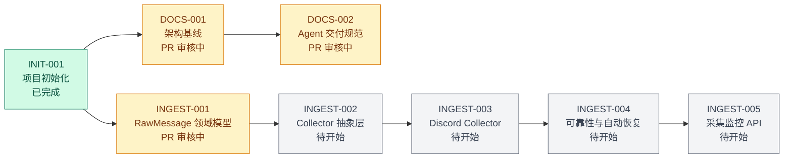
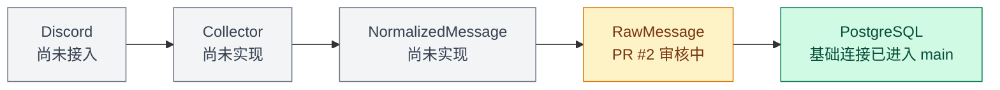

# AI Copy Trading System 项目状态

> 最后更新：2026-09-03
> 状态依据：`origin/main` 与 GitHub Pull Request 的实际状态

## 当前里程碑

`M1 — Discord 消息采集`

M1 的目标是从 Discord 目标频道获取消息，通过可替换的 Collector 进行标准化，将原始事实保存为 `RawMessage` 并持久化到 PostgreSQL，同时具备去重、恢复和健康监控能力。M1 不实现 AI 解析、`TradingIntent`、风险控制或交易执行。

## 状态说明

- ✅ 已完成：已 Merge 到 `main`
- 🟡 PR 审核中：已完成开发并已建立 PR，但尚未 Merge
- 🚧 开发中：当前 feature branch 正在开发
- ⛔ 阻塞：需要外部决策或依赖后才能继续
- ⏳ 待开始：尚未进入开发

## 里程碑进度

| 状态 | Issue | 完整标题 | 当前依据 |
| --- | --- | --- | --- |
| ✅ 已完成 | INIT-001 | 初始化 AI Copy Trading 项目 | FastAPI、PostgreSQL、Alembic 与 Next.js 初始化已进入 `main` |
| 🟡 PR 审核中 | DOCS-001 | 建立项目架构基线 | GitHub PR #1 仍为 Open，尚未 Merge 到 `main` |
| 🟡 PR 审核中 | INGEST-001 | 实现 RawMessage 领域模型 | GitHub PR #2 仍为 Open，尚未 Merge 到 `main` |
| 🟡 PR 审核中 | DOCS-002 | 建立 Agent 固定交付规范与项目进度可视化机制 | GitHub PR #3 已创建，尚未 Merge 到 `main` |
| ⏳ 待开始 | INGEST-002 | 实现 Collector 抽象层 | 未开始 |
| ⏳ 待开始 | INGEST-003 | 实现 Discord Collector | 未开始 |
| ⏳ 待开始 | INGEST-004 | 实现采集可靠性与自动恢复 | 未开始 |
| ⏳ 待开始 | INGEST-005 | 实现采集监控 API | 未开始 |

## M1 项目状态图

## M1 数据流实现状态

## 下一步

1. 审核并决定是否 Merge DOCS-001 PR #1、INGEST-001 PR #2 和 DOCS-002 PR #3。
2. 只有在相应 PR Merge 到 `main` 后，才将状态改为“✅ 已完成”。
3. 不在 DOCS-002 中开始 INGEST-002。
