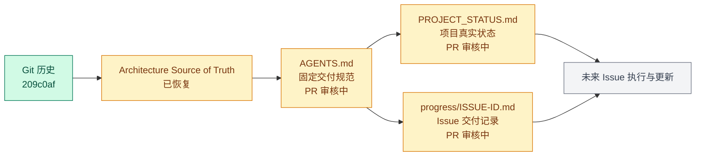

# DOCS-002 — 建立 Agent 固定交付规范与项目进度可视化机制

## 当前状态

🟡 PR 审核中

## Pull Request

[GitHub PR #3](https://github.com/norafu-dev/ai-trading/pull/3)

## 本任务目标

- 恢复已经确认的 Architecture Source of Truth。
- 在根目录 `AGENTS.md` 中固化未来 Issue 的交付、Git 与 PR 规范。
- 建立项目总进度和每个 Issue 的 Progress 文档机制。
- 用 Mermaid 区分已完成、PR 审核中、开发中和尚未实现的内容。

## 本次完成内容

- 从 Git 提交 `209c0aff005769634ad19f0947e38148230dbc08` 原样恢复 `docs/AI_COPY_TRADING_ARCHITECTURE.md`，未重新设计或改写其架构内容。
- 在 `AGENTS.md` 中新增 `Agent Task Delivery Rules`。
- 创建 `docs/PROJECT_STATUS.md`，记录 M1 真实进度和状态判定标准。
- 创建 `docs/progress/DOCS-002.md`，并将 Progress 文档确立为未来每个 Issue 的固定交付物。
- 建立项目状态图和 DOCS-002 文档流程图。

## 主要文件变更

- `AGENTS.md`：固定执行前必读、架构保护、正式交付物、状态与 Git / PR 规范。
- `docs/AI_COPY_TRADING_ARCHITECTURE.md`：从已确认的历史提交恢复。
- `docs/PROJECT_STATUS.md`：新增 M1 里程碑、Issue 状态表和 Mermaid 可视化。
- `docs/progress/DOCS-002.md`：新增当前 Issue 的可追踪交付记录。

## 当前系统新增能力

项目新增了可持续复用的 Agent 交付契约和仓库内进度 Source of Truth。本 Issue 未新增任何业务运行能力。

## 关键技术决策

1. 架构文档以历史基线的字节级内容为准，不由 DOCS-002 重新设计。
2. 状态判定以 `main` 和 GitHub PR 为事实来源；未 Merge 的 DOCS-001 和 INGEST-001 均不标记为已完成。
3. Mermaid 仅展示真实实现状态，未来模块显式标注为尚未实现。
4. DOCS-002 只改动文档和 Agent Workflow 基础设施，不修改 `RawMessage` 或实现后续 Milestone。

## 测试 / 检查结果

- 架构文档 blob 与历史提交 `209c0af` 一致：通过。
- Markdown 链接扫描：通过，未引入失效的仓库内链接。
- Mermaid 代码块配对检查：通过，共 3 个 Mermaid 图。
- `git diff --check`：通过。
- `.venv/bin/pytest`：1 passed，1 skipped；数据库集成测试因未设置 `RUN_DB_TESTS=1` 而跳过。

## 当前架构位置

DOCS-002 属于项目工程治理和文档基础设施，不属于 Ingestion、Intelligence、Trade Domain、Risk、Execution 或 Operations 任一业务运行域。

## 已知问题 / 风险

- DOCS-001 PR #1 仍未 Merge，DOCS-002 与其同时包含完全相同的架构基线文件；合并顺序变化时可能需要重新同步 `main`。
- INGEST-001 PR #2 仍未 Merge，因此 `RawMessage` 仅能标记为 PR 审核中。
- 本 Issue 只能建立并强化文档契约；规范的长期准确性仍依赖后续 Agent 在每个 Issue 中持续维护。

## 下一步

1. 由人工审核 GitHub PR #3；本 Issue 不自动 Merge。
2. PR Merge 后将 DOCS-002 在项目状态中更新为“✅ 已完成”。
3. 未来 Issue 按 `AGENTS.md` 更新项目总进度和对应 Progress 文档。
