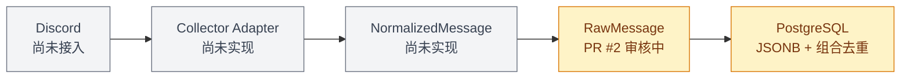

# INGEST-001 — 实现 RawMessage 领域模型

## 当前状态

🟡 PR 审核中

## Pull Request

[GitHub PR #2](https://github.com/norafu-dev/ai-trading/pull/2)

## 本任务目标

在 M1 Ingestion 领域建立 `RawMessage` 事实模型、Schema、Alembic migration 和 Repository，将外部平台消息完整、可去重地保存到 PostgreSQL。

## 本次完成内容

- 实现 SQLAlchemy `RawMessage` 模型与 Pydantic create/read Schema。
- 新增 `raw_messages` Alembic migration。
- 使用 `(platform, message_id)` 作为跨平台消息身份唯一边界。
- Repository 支持通过 `get_by_platform_message_id(platform, message_id)` 精确查询。
- PostgreSQL 中 `attachments`、`embeds`、`raw_payload` 使用 `JSONB`；SQLite 测试使用兼容的 `JSON` variant。
- 新增 opt-in PostgreSQL integration test，在独立临时 schema 中验证表结构、JSONB 列和组合唯一约束行为。

## 主要文件变更

- `backend/ingestion/models.py`
- `backend/ingestion/schemas.py`
- `backend/ingestion/repository.py`
- `apps/api/alembic/versions/20260903_0002_add_raw_messages.py`
- `tests/test_raw_message.py`
- `tests/test_raw_message_postgresql.py`
- `docs/PROJECT_STATUS.md`
- `docs/progress/INGEST-001.md`

## 当前系统新增能力

系统可以保存完整原始消息事实，在同一平台内阻止重复 `message_id`，同时允许不同平台使用相同的外部消息 ID。

## 关键技术决策

- 外部消息的稳定身份是 `(platform, message_id)`，而不是全局单列 `message_id`。
- PostgreSQL 生产 Schema 优先使用 `JSONB`，不为 SQLite 单元测试降低生产数据库设计。
- Integration test 使用随机命名的 PostgreSQL schema，测试后精确删除，避免触碰其他开发数据。

## 测试 / 检查结果

- SQLite + PostgreSQL 全量测试：`9 passed`。
- PostgreSQL 实际验证：3 个 JSON 事实列均为 `JSONB`；同 platform + 同 message ID 触发 `IntegrityError`；不同 platform + 同 message ID 可正常保存和查询。
- Alembic PostgreSQL offline SQL：生成 `UNIQUE (platform, message_id)` 与 3 个 `JSONB` 列。
- Python compileall：通过。
- `git diff --check`：通过。

## 当前架构位置

## 已知问题 / 风险

- PostgreSQL integration test 默认为 opt-in，需显式设置 `RUN_DB_TESTS=1` 和测试数据库 `DATABASE_URL`。
- PR #2 尚未 Merge，因此功能不得标记为“✅ 已完成”。

## 下一步

1. 由人工审核 PR #2；本 Issue 不自动 Merge。
2. PR Merge 后再将 INGEST-001 更新为“✅ 已完成”。
3. 本 Issue 不开始 INGEST-002。
