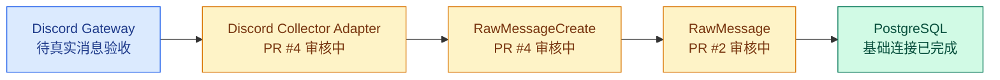

# NORA-10 / MVP-001 — 实现 Discord → RawMessage → PostgreSQL 的最小闭环

## 当前状态

🟡 PR 审核中

## Pull Request

[GitHub PR #4](https://github.com/norafu-dev/ai-trading/pull/4)

## 本任务目标

用独立长期运行的 Collector 接收一条真实 Discord 消息，将其标准化为 `RawMessageCreate`，并幂等保存到 PostgreSQL；不引入 Redis、Celery、AI 或交易逻辑。

## 本次完成内容

- 新增可替换的 `BaseCollector` 边界和 Discord 官方 Bot Gateway 适配器。
- 支持频道与可选作者 allowlist，保留文本、回复、附件、Embed 和原始 Gateway payload。
- 新增独立 `apps.collector` 进程，将消息通过 `MessageIngestionService` 写入数据库。
- 增加幂等保存能力，重复 `(platform, message_id)` 返回已有事实，不重复插入。
- 补充环境配置、启动步骤和数据库验收 SQL。

## 主要文件变更

- `apps/collector/config.py`
- `apps/collector/main.py`
- `backend/ingestion/collectors.py`
- `backend/ingestion/discord.py`
- `backend/ingestion/service.py`
- `backend/ingestion/repository.py`
- `tests/test_discord_collector.py`
- `README.md`

## 当前系统新增能力

在 Discord 官方 Bot 具备服务器和频道权限时，系统可以持续监听指定频道，并将真实消息在 PostgreSQL 中保存为完整、可审计且去重的 `RawMessage`。

## 关键技术决策

- Collector 作为独立进程运行，不占用 FastAPI 生命周期。
- 只支持 Discord 官方 Bot token，不实现违反 Discord 条款且有封号风险的 self-bot。
- 使用数据库唯一约束作为最终幂等边界，应用层同时返回 inserted / duplicate 结果。
- 原始 `MESSAGE_CREATE` Gateway payload 优先保存；无法取得时保存可观察字段构成的 fallback payload。

## 测试 / 检查结果

- SQLite 单元与链路测试：`12 passed, 2 skipped`；跳过项为显式 opt-in 的 PostgreSQL 测试。
- 临时 PostgreSQL 16 实例全量测试：`14 passed`，覆盖真实 PostgreSQL 连接、`JSONB`、组合唯一约束与 Discord 标准化到数据库的闭环。
- Alembic PostgreSQL `upgrade head → downgrade base → upgrade head`：通过。
- Python `compileall`：通过。
- `git diff --check`：通过。
- 未执行真实 Discord Gateway 联调：工作区未提供 Bot token 与可授权频道。

## 当前架构位置

## 已知问题 / 风险

- 当前没有可提交到自动化测试的 Discord Bot token 与目标频道，因此真实 Gateway 联调必须由具备服务器权限的人工按 README 执行。
- 目标 Discord 服务器若无法邀请官方 Bot，本适配器无法绕过该权限限制；需要后续选择合规、可授权的 Collector Adapter。
- 本分支显式包含尚未 Merge 的 NORA-8 PR #2 与 DOCS-002 PR #3 前置提交。

## 下一步

1. 审核目标为 `main` 的 PR #4。
2. 由具备 Discord 权限的人工完成一条真实消息验收。
3. 验收后由人工决定是否 Merge；本任务不自动 Merge PR。
